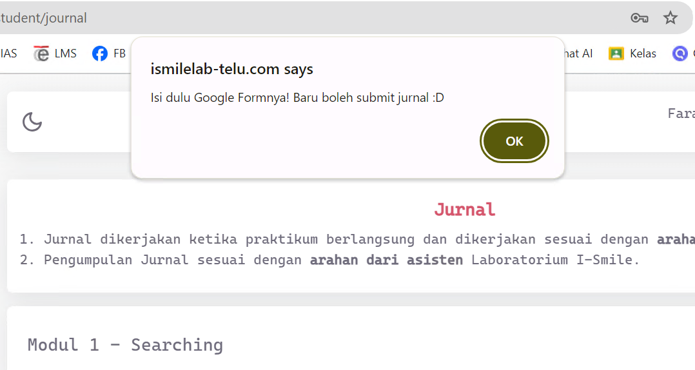
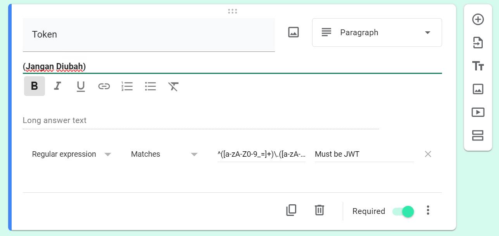
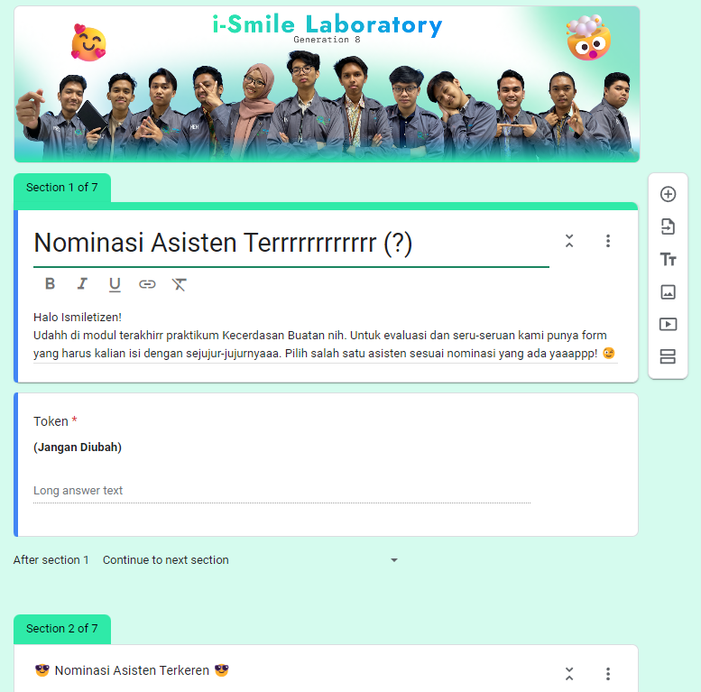
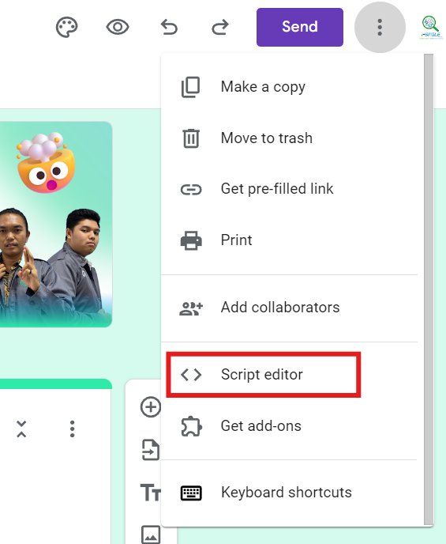
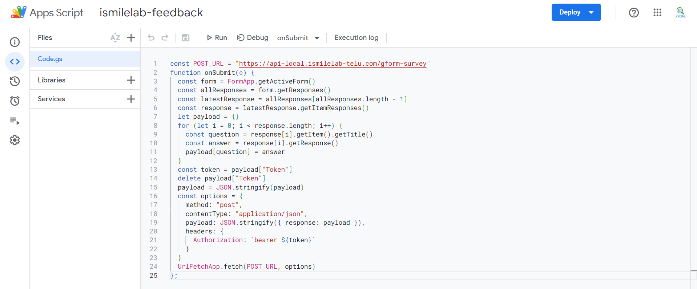
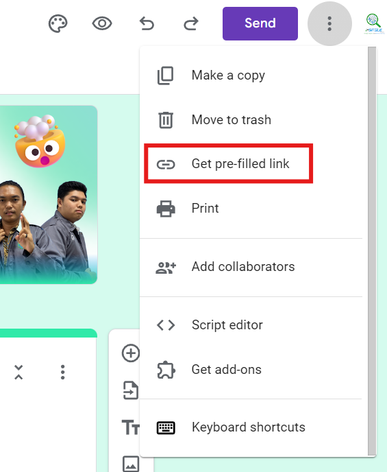

# Integrating Google Forms with Journal Submission

This guide will walk you through integrating Google Forms with the Jurnal system, ensuring users complete the form before submitting their journal.



## 1. Setting up the Google Form

Create a Google Form as you normally would for a survey or feedback form. Ensure that you add a **Token** field at the beginning of the form. This will serve as an identifier for the submission process. 

To validate the token, add the following regex pattern: 
```
^([a-zA-Z0-9_=]+)\.([a-zA-Z0-9_=]+)\.([a-zA-Z0-9_\-\+\/=]*)
```




Here's an example of how the form should look:



## 2. Inserting Script for Form Responses

After setting up your form, navigate to the **Script Editor** located at the top right corner of the Google Form:



## 3. Setting Up Script Editor

In the script editor, copy and paste the code from [gform-survey.js](gform-survey.js). The script will automatically manage the submission of responses.

Make sure to set the trigger on **form submit**, as shown below:



Once the script is in place and the trigger is set, you can close the script editor.

## 4. Getting a Prefilled Token Link

Now, you’ll need a prefilled link for the token. Go to the form’s settings and click on **Get pre-filled link**:



Enter any placeholder text in the **Token** field and click **Get Link** at the end of the form. The link generated should look something like this:
> https://docs.google.com/forms/d/e/.../viewform?usp=pp_url&entry.2072338726=apapun

Replace the placeholder text (in this case, 'apapun') with `${token}`.

## 5. Modifying `JournalOverlay.js`

Next, head over to [JournalOverlay.js](https://github.com/ismilelab-telu/ismilelab-web/blob/master/src/views/pages/student/Journal/JournalOverlay.js) in the `ismilelab-web` repository and uncomment the code below. Replace the link with the prefilled link generated earlier:

```js
if (isValid) {
    setIsOpen(!isOpen)
} else {
  window.open(`https://docs.google.com/forms/d/e/.../viewform?usp=pp_url&entry.2072338726=${appToken}`)
  alert("Isi dulu Google Formnya! Baru boleh submit jurnal :D")
}
```

Once done, the system will now prompt users to fill out the Google Form before submitting their journal.

>_Additional resources and inspiration for setting up Google Forms webhook submissions were drawn from this guide by [Eyal Gershon](https://medium.com/@eyalgershon/sending-a-webhook-for-each-google-forms-submission-a0e73f72b397)._